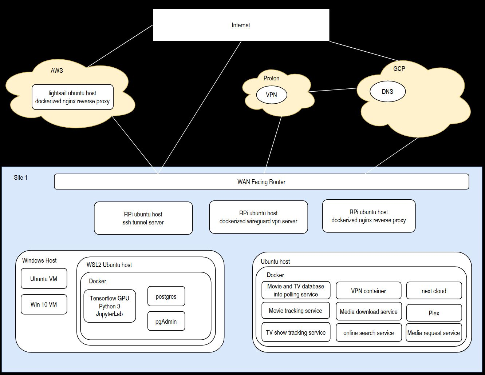

# homelab
One of my longest projects, a distributed network of Windows and Linux hosts which provide dockerized services. and some, virtual machines
## Block Diagram

## Server Monitoring for one machine hosting multiple dockerized services

## Media Request Service

## Tensorflow Jupyter Lab Server

